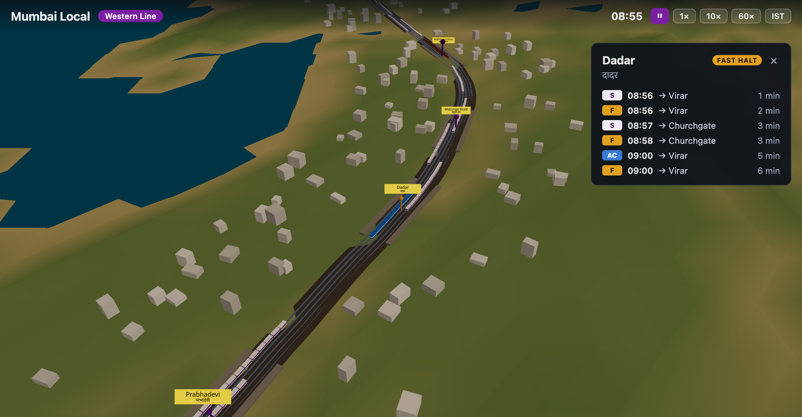
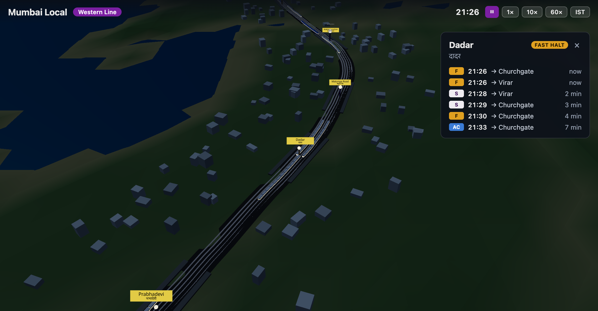
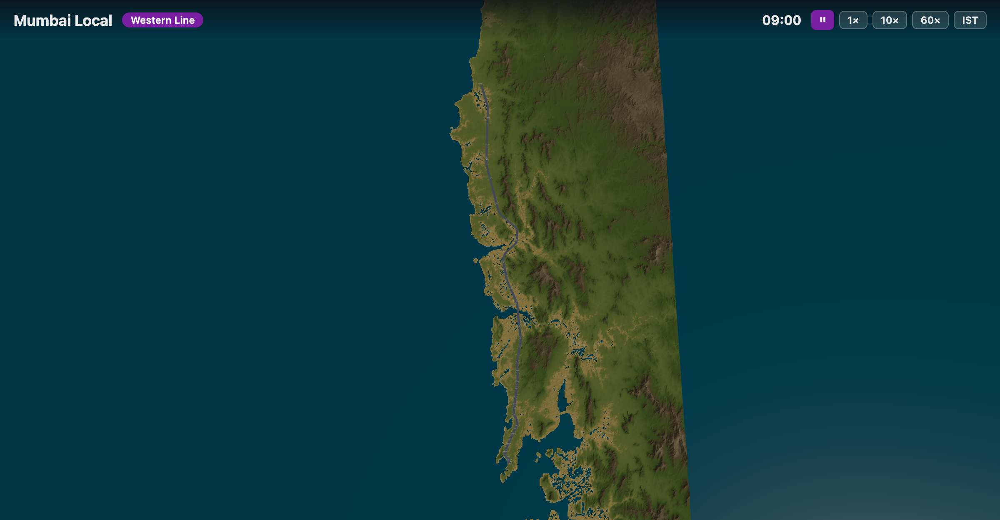
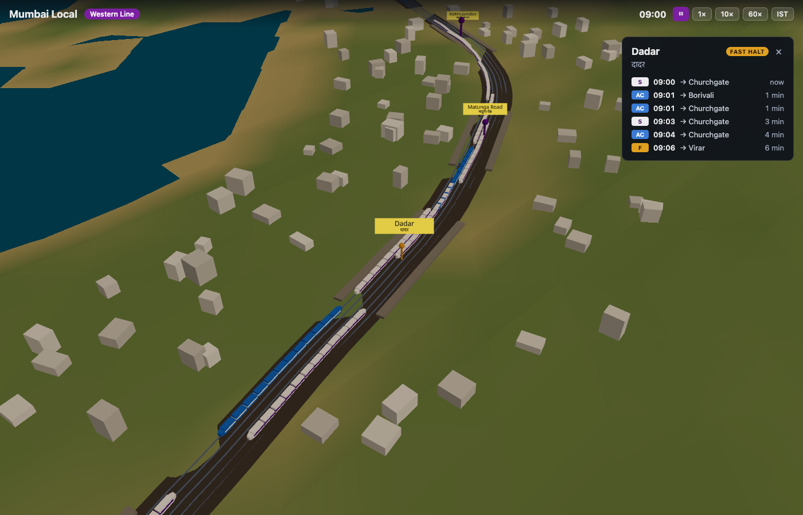

# Mumbai Local

A real-time 3D simulation of the Mumbai suburban railway — Western line v1,
Churchgate → Dahanu Road — running the real Western Railway timetable over
real geography.

**Live:** https://mehimanshupatil.github.io/mumbai-local-sim/



## What it does

- Real track geometry and all 37 stations baked from OpenStreetMap, draped
  over a real terrain heightfield — the Arabian Sea, Mahim bay, the Vasai
  creek crossing, and the Sahyadri foothills are where they belong.
- Every slow, fast, and AC local runs on the actual Western Railway Public
  Time Table (1,321 real services, baked from the official PTT PDFs — see
  Data baking below), not a synthetic approximation: real departure times,
  real turnback termini, real skip-stop variations. Long-distance expresses
  are the one synthetic layer left, since suburban PTTs don't carry mainline
  mail/express timings. Fast locals genuinely overtake slows — it emerges
  from real schedule differences, nothing is scripted.
- A pure, deterministic simulation core drives it all: `(network, services,
  simTime) → TrainState[]`, no kinematics guesswork needed since real
  timetables already carry the true inter-station timing.
- A sim clock (pause / 1× / 10× / 60×, one-shot sync to live IST) drives the
  timetable *and* a day/night cycle — at 60× the corridor sweeps dawn, golden
  dusk, and a lamp-lit night with headlights and glowing coach windows.
- Click a train for a chase camera; click a station for its arrivals board
  (predictions come from the same timetables the trains run, so they can't
  disagree). Navigation works like a maps app: drag pans, right-drag tilts,
  wheel zooms to cursor.





## Run it

```sh
pnpm install
pnpm dev      # dev server
pnpm test     # sim-core + baked-data invariant tests
pnpm build    # typecheck + production bundle
```

## Data baking

All geographic data is baked offline and committed — the site makes no
runtime calls to OSM or elevation services.

```sh
pnpm bake                # network: stations, chainage, track sections ← Overpass
pnpm bake:terrain        # heightfield ← AWS Terrain Tiles (terrarium)
pnpm bake:realtimetable  # real timetable ← official WR PTT PDFs (data/timetable/)
```

All three cache raw responses under `scripts/.cache/` (add `--refresh` to
refetch `bake`/`bake:terrain`) and validate against known reality — station
order, monotonic chainage, per-section track counts (4 Churchgate–Mumbai
Central, 4–6 to Borivali, 4 to Virar, 2 beyond), sea west / hills east,
service-id uniqueness — failing loudly on drift. `bake:realtimetable` is a
two-stage pipeline (`python3 scripts/extract-timetable-pdfs.py` first — see
`CLAUDE.md`) and re-runs on any new PTT with no code changes: just drop the
PDFs in `data/timetable/`. Invariant tests over all committed JSON run in CI.

## Architecture

Two layers with one seam: a pure simulation core
(`(network, services, simTime) → TrainState[]`, no React/three.js — see
`src/sim/`) and a rendering layer that consumes it. `buildTimetable` and
`buildRealTimetable` both produce the same `Timetable` shape — one derives
motion from kinematics (the synthetic express layer), the other from known
real durations — so the rendering/query side (`trainStates`, arrivals,
camera follow) doesn't know or care which a given service came from. The
network format is line-agnostic so Central/Harbour arrive as new baked
datasets, not new code. See `CLAUDE.md` for conventions.

## Data sources & licenses

- Track/station data © [OpenStreetMap](https://www.openstreetmap.org/copyright) contributors (ODbL)
- Terrain: [AWS Terrain Tiles](https://registry.opendata.aws/terrain-tiles/) (terrarium)
- Timetable: Western Railway Public Time Tables, W.E.F. 01.05.2026 (`data/timetable/`)
- Fonts: Noto Sans / Noto Sans Devanagari ([OFL](public/fonts/OFL.txt))
- Station metadata for kinematics calibration: `data/` (third-party, reference only)
